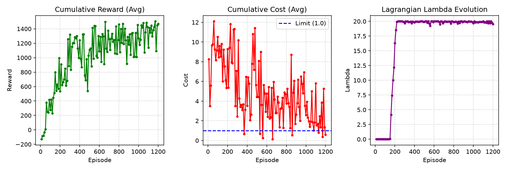
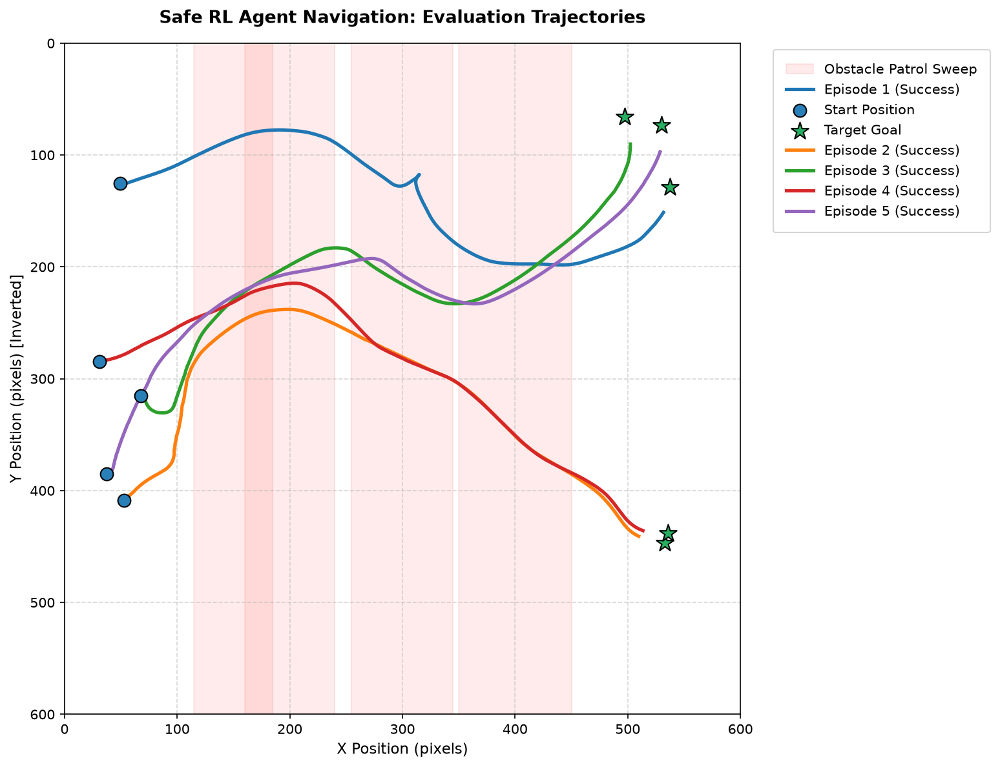

# Dynamic Safe RL Autonomous Navigation

[](https://www.python.org/)
[](https://pytorch.org/)
[](https://gymnasium.farama.org/)
[](https://opensource.org/licenses/MIT)

An implementation of an autonomous agent navigating dynamic environments under safety constraints. The project leverages **Safe Soft Actor-Critic (Safe SAC)** with an adaptive **Lagrangian Multiplier** controller to enforce strict boundary safety limits while maximizing navigational efficiency.

---

## 📽️ Agent Demonstration

Below is the agent demonstrating its navigation capabilities in the obstacle-filled environment. 

*(To display your custom video or GIF here, follow the [Showcase Guide](#-showcase-guide) below).*


---

## 🎯 Project Overview

In autonomous navigation, standard Reinforcement Learning (RL) agents often optimize only for speed and goal attainment, resulting in high collision rates during exploration. This project models navigation as a **Constrained Markov Decision Process (CMDP)**:

$$\max_{\theta} \mathbb{E} \left[ \sum_{t=0}^{\infty} \gamma^t r(s_t, a_t) \right] \quad \text{subject to} \quad \mathbb{E} \left[ \sum_{t=0}^{\infty} \gamma^t c(s_t, a_t) \right] \le \epsilon$$

Where:
- $r(s, a)$ is the progress-driven reward function (rewarding forward velocity and distance reduction to the target).
- $c(s, a)$ is the constraint safety cost function measuring proximity breaches to obstacles.
- $\epsilon$ is the user-defined safety budget threshold (set to $1.0$).

### Key Features
1. **Dynamic Lagrangian Safety Controller**: Adaptively adjusts the penalty weight $\lambda$ based on constraint violations to maintain safe behavior without causing training paralysis.
2. **Twin Q-Networks (SAC)**: Uses twin critic networks to calculate stable Q-value approximations and prevent policy overestimation.
3. **Continuous Actions**: Outputs continuous linear acceleration and steering velocity commands.
4. **Generalization Sandbox**: Tests zero-shot spatial transfer in a $1.77\times$ larger sandbox environment with $2\times$ more dynamic obstacles.

---

## 📁 Repository Directory Structure

```
.
├── assets/                       # Image and GIF showcase files
│   ├── training_performance.png  # SAC reward and cost curves
│   └── evaluation_trajectories.png # Route trajectory map
├── models/                       # Pre-trained actor weights
│   ├── safe_sac_actor.pth        # Safe SAC model parameters
│   └── unconstrained_sac_actor.pth # Static penalty baseline model
├── src/                          # Project source scripts
│   ├── agent.py                  # Critic/Actor PyTorch architectures & Replay Buffer
│   ├── env.py                    # Custom SafeNavigationEnv Gym environment
│   ├── evaluate.py               # Evaluation script for the trained agent
│   ├── evaluate_compare.py       # Comparative script (Safe vs. Unconstrained)
│   ├── evaluate_large_sandbox.py  # Generalization tests in the larger sandbox environment
│   ├── lagrangian.py             # Adaptive Lagrangian Multiplier optimizer
│   ├── manual_test.py            # Utility to control the agent with keyboard keys
│   ├── manual_test_pygame.py     # Diagnostics utility to check Pygame rendering
│   ├── plot_trajectories.py      # Trajectory plotting script
│   ├── record_trajectories.py    # Records evaluation paths to JSON
│   └── train.py                  # Main training loop script
├── .gitignore                    # Prevents tracking local caches and virtual environments
├── requirements.txt              # Project library dependencies
└── README.md                     # Project documentation
```

---

## 🚀 Quick Start & Installation

### 1. Setup Virtual Environment
```bash
# Clone the repository
git clone https://github.com/yourusername/safe-rl-navigation.git
cd safe-rl-navigation

# Initialize and activate a virtual environment
python3 -m venv safe_rl_env
source safe_rl_env/bin/activate
```

### 2. Install Dependencies
```bash
pip install -r requirements.txt
```

### 3. Verify Setup
Run a pipeline diagnostic to verify that Gymnasium, PyTorch, and Pygame are integrated correctly:
```bash
python3 src/verify_pipeline.py
```

---

## 💻 Usage & CLI Guide

All scripts are equipped with Command-Line Interfaces (CLIs) for configurable execution.

### Evaluate Pre-trained Agent (Windowed Rendering)
Run the pre-trained Safe SAC policy to watch the agent navigate obstacles in real time:
```bash
python3 src/evaluate.py --episodes 5
```
*(Disable Pygame windows for headless servers using `--no-render`)*

### Zero-Shot Generalization Sandbox
Test the spatial scale-invariance of the Safe SAC agent on a larger $800\times800\text{px}$ map populated with $8$ dynamic obstacles:
```bash
# Runs 100 evaluation episodes quickly (headless)
python3 src/evaluate_large_sandbox.py --episodes 100

# To view the sandbox runs visually
python3 src/evaluate_large_sandbox.py --episodes 5 --render
```

### Comparative Evaluation (Safe vs. Unconstrained)
Compare the success rate, collision rate, and safety cost between the Constrained Safe agent and the Unconstrained baseline agent over 50 episodes:
```bash
python3 src/evaluate_compare.py --episodes 50
```

### Manual Drive Mode
Control the navigation agent manually using the keyboard arrow keys to inspect the environmental physics and check proximity cost boundaries:
```bash
python3 src/manual_test.py
```

### Retraining Agents
If you wish to retrain the models, run:
```bash
# Train the Safe SAC Agent with Lagrangian optimization
python3 src/train.py --episodes 1200

# Train the Baseline Unconstrained Agent with static penalty Beta
python3 src/train_unconstrained.py --episodes 1200
```

---

## 📊 Performance Visualizations

### 1. Training Curves
The plots show the convergence of cumulative rewards and the stabilization of safety costs as the Lagrangian multiplier $\lambda$ dynamically balances performance and safety.



### 2. Evaluation Trajectories
The path map shows the Safe SAC agent navigating around the dynamic obstacle swept zones (light red bands) to safely reach the destination from different spawn locations.



### 3. Quantitative Comparison (Safe vs. Unconstrained)
The table below highlights performance metrics averaged over $100$ random evaluation episodes:

| Policy Model | Success Rate (%) | Collision Rate (%) | Avg Episode Reward | Avg Episode Safety Cost |
| :--- | :---: | :---: | :---: | :---: |
| **Constrained SAC (Lagrangian)** | **94.0%** | **6.0%** | **1435.76** | **1.63** |
| Unconstrained SAC (Static Beta) | 56.0% | 41.0% | 919.57 | 7.02 |

*Note: The Constrained SAC policy reduces the collision rate by **85.4%** compared to the unconstrained baseline (6.0% vs. 41.0%), while simultaneously increasing the target success rate from 56.0% to 94.0%. This highlights the effectiveness of dynamic safety constraints over static penalty parameters.*

### 4. Zero-Shot Generalization Performance
To test spatial scale-invariance and robustness to increased crowding, the agent was evaluated directly in the **Large Sandbox** environment ($800\times800\text{px}$ map with $8$ dynamic obstacles) without any retraining:

| Metric | Evaluation Value |
| :--- | :---: |
| **Success Rate** | **69.0%** |
| **Collision Rate** | **30.0%** |
| **Average Episode Reward** | **1476.25** |
| **Average Episode Safety Cost** | **6.13** |

*Note: Navigating a $1.77\times$ larger area populated with $2\times$ more dynamic obstacles presents significantly higher difficulty. Achieving a 69.0% success rate in a zero-shot setting demonstrates the policy's spatial generalization and lidar-based obstacle avoidance robustness.*


---

## 📹 Showcase Guide: Adding Your Video to GitHub

To showcase your 1-minute video demonstration on GitHub, you can use one of these two methods:

### Method A: High-Quality GIF/WebP (Recommended for Autoplay)
GIF and WebP formats loop automatically in a repository README.
1. Convert your `.mp4` video into an optimized `.gif` or `.webp` file using `ffmpeg`:
   ```bash
   # Convert to GIF (optimized using lanczos filter, 15 FPS, 500px width)
   ffmpeg -i input_video.mp4 -vf "fps=15,scale=500:-1:flags=lanczos" -loop 0 assets/safe_navigation_demo.gif
   ```
2. Replace `assets/safe_navigation_demo.gif` in the repository with your newly generated file.
3. Commit and push the file to GitHub.

### Method B: Direct MP4 Video Player Embed (Premium HTML5 Player)
GitHub supports native `<video>` tag embedding.
1. Open your repository page on GitHub.com.
2. Edit your `README.md` file using the web editor.
3. **Drag and drop** your `.mp4` video file directly into the editor pane.
4. GitHub will upload the video file to its asset server and insert code similar to this:
   ```html
   <video src="https://github.com/user-attachments/assets/xyz-123" controls="controls" style="max-width: 100%;"></video>
   ```
5. Copy that code and replace the `` line with it.

---

## 📝 License
This project is licensed under the MIT License - see the [LICENSE](LICENSE) file for details.
